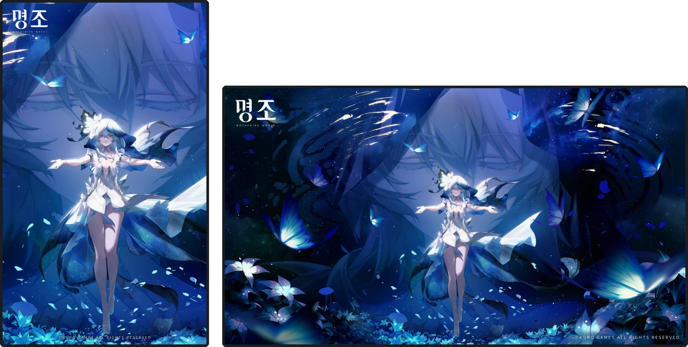

# 🖥️ MOSAMONI

모니터마다 **다른 바탕화면**을 걸고, 모니터마다 **따로 도는 슬라이드쇼**를 돌리는 Windows 앱입니다.

**[👉 소개 페이지](https://bulsajyo.github.io/MOSAMONI/)**

---

## 내려받기

**[MOSAMONI-Setup-1.0.0.exe 받기](https://drive.google.com/file/d/1ZtijGwx5WX195aouzsBKqSpvBxcKUBYh/view?usp=sharing)**  (75MB)

설치할 때만 관리자 권한이 필요하고, **앱 자체는 승격 없이 돕니다.**

### 받고 설치할 때 경고가 두 번 뜹니다

둘 다 정상입니다. 파일이 잘못된 것이 아닙니다.

**1. 구글 드라이브 — "바이러스 여부를 검사할 수 없습니다"**

구글 드라이브는 **25MB 가 넘는 파일을 검사하지 않습니다.** 이 설치 파일은 75MB 라
크기 때문에 검사에서 빠지는 것이고, 파일에 문제가 있다는 뜻이 아닙니다.
**다운로드**를 누르시면 됩니다.

**2. Windows — "Windows의 PC 보호"**

**추가 정보** → **실행** 을 누르면 진행됩니다.
코드 서명 인증서가 없어서 뜨는 것으로, 서명이 없는 모든 설치 파일에 똑같이 나타납니다.

---

## 이렇게 보입니다

31.5″ 가로 모니터와 23.8″ 세로 모니터에 **서로 다른 이미지**가 걸려 있습니다.
각각 다른 폴더를 보고 있어 슬라이드쇼도 따로 돕니다.
두 모니터의 크기 차이는 **실제 물리 크기 그대로**입니다.

바탕화면 이미지: 명조(Wuthering Waves) © Kuro Games 공식 배포 월페이퍼

---

## 무엇을 하는가

### 모니터마다 다른 바탕화면
모니터별로 따로 겁니다. 레지스트리를 건드리지 않습니다.

### 모니터마다 따로 도는 슬라이드쇼
- 폴더를 지정하면 그 안의 이미지를 순서대로 또는 무작위로 돌립니다.
- 간격을 모니터마다 따로 정합니다.
- **이전 / 다음** 버튼으로 즉시 넘깁니다. 슬라이드쇼를 멈춘 상태에서도 됩니다.
- 재생 위치를 저장해서 껐다 켜도 **보던 자리에서 이어집니다.**
- 원하면 모든 모니터가 **같은 번째 장**을 함께 넘기도록 맞출 수 있습니다.

### 화면 보호기
모든 모니터에 동시에 뜨고 부드럽게 넘어갑니다. Windows 설정의 화면 보호기 목록에
정식으로 등록되며, 미리보기도 나옵니다. 모니터마다 다른 폴더를 쓸 수 있습니다.

> 앱이 꺼져 있으면 화면 보호기도 뜨지 않습니다.

### 실물 비율 배치 편집기
모니터를 끌어서 실제 책상 위 배치와 맞춥니다.

- **모니터의 물리적 크기를 읽어 인치까지 반영합니다.** 27인치 옆의 24인치가
  화면에서도 그만큼 크게 보입니다.
- 크기를 못 읽으면 FHD 24인치로 잡고, **우클릭 → 크기 입력**으로 고칠 수 있습니다.
- 빈 배경을 끌면 화면이 따라오고, 휠로 확대·축소합니다.

### 화면 보정
바탕화면과 화면 보호기에 각각 따로 겁니다. 보정 창에서 크게 보며 조절하고,
저장을 눌러야 반영됩니다.

| 항목 | 하는 일 |
|---|---|
| 색 보정 | 원본 · 흑백 · 흑백(강한 대비) · 느와르 · 세피아 |
| 밝기 | 어둡게 / 밝게 |
| 빛 강조 | 밝은 부분이 번지는 효과 |
| 색감 유지 | 밝기를 낮출 때 빠지는 채도를 되살립니다 (자동/수동) |

밝기와 빛 강조는 **2D 패널**에서 한 점을 찍어 한 번에 잡습니다.

### 그 밖에
- **테마 3종** — 캘리브레이션(기본) · Windows 기본 · 웜 페이퍼
- **언어 4종** — 한국어 · 영어 · 일본어 · 중국어
- **창 투명도** — 실제로 뒤가 비칩니다.
- **트레이 상주**, **Windows 시작 시 자동 실행**

---

## 알아 둘 것

**맞춤 방식은 모니터마다 다르게 줄 수 없습니다.**
Windows 가 모든 모니터에 한꺼번에 적용하는 전역 설정이라 막혀 있습니다.
맞춤 방식은 전역 항목으로 쓰세요.

**설정은 `%APPDATA%\MOSAMONI` 에 있습니다.**
프로그램을 지워도 남습니다. 제거할 때 함께 지울지 물어봅니다.

---

## 요구 사항

| 항목 | 내용 |
|---|---|
| 운영체제 | Windows 10 / 11 (x64) |
| 런타임 | 필요 없음 — 실행에 필요한 것을 모두 담아 배포합니다 |
| 권한 | 설치할 때만 관리자. 실행은 일반 권한 |
| 이미지 형식 | JPG · JPEG · PNG · BMP · GIF · TIFF |

---

## 후원

MOSAMONI는 무료이고 앞으로도 무료입니다.
쓰시다가 마음이 동하시면 여기로 보내실 수 있습니다.
보내지 않으셔도 기능은 하나도 잠기지 않습니다.

**[후원하기](https://donatr.ee/bulsajyo)**

---

## 문제가 생기면

`%APPDATA%\MOSAMONI\debug_log.txt` 를 함께 알려 주시면 좋겠습니다.
(그 파일에는 지정하신 폴더 경로가 들어 있으니, 올리기 전에 지우셔도 됩니다)

[Issues](https://github.com/bulsajyo/MOSAMONI/issues) 로 알려 주세요.

---

SixLabors.ImageSharp (Apache-2.0) · Newtonsoft.Json (MIT) 를 사용합니다.
